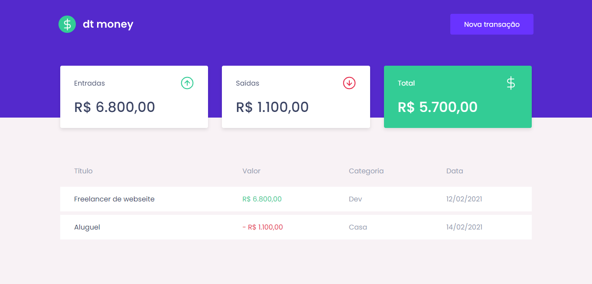
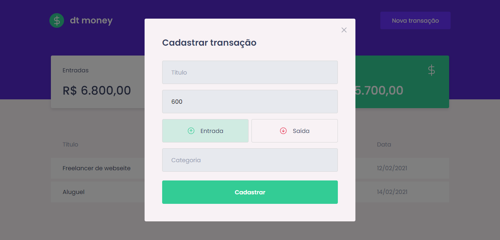

<div align="center">
  
</div>

<h3 align="center">
  Gerencie suas finanças de uma forma simples e eficaz.
</h3>

<h4 align="center">
  Projeto construído durante a Trilha React do Ignite da Rocketseat
</h4>

---

## Screenshots




## Tecnologias

- [ReactJS](https://reactjs.org/)
- [TypeScript](https://www.typescriptlang.org/)
- [Styled-components](https://styled-components.com/)
- [Mirage JS](https://miragejs.com/)
- [Node.JS](https://nodejs.org/en/)


## Iniciando

### Requisitos

- [Git](https://git-scm.com/)
- [Node.JS](https://nodejs.org/en/)
- [Yarn](https://yarnpkg.com/) ou [NPM](https://www.npmjs.com/)

```bash
  # Clone o repositório
  $ git clone https://github.com/gjoao11/dtmoney.git

  # Acesse a pasta do projeto
  $ cd dtmoney

  # Instale as dependências
  $ yarn

  # Inicie a aplicação
  $ yarn start

  # Acesse a aplicação em: http://localhost:3000
```
## Licença

Este projeto está sob a licença MIT. Veja a arquivo [LICENSE](https://github.com/gjoao11/dtmoney/blob/main/LICENSE) para mais detalhes.
